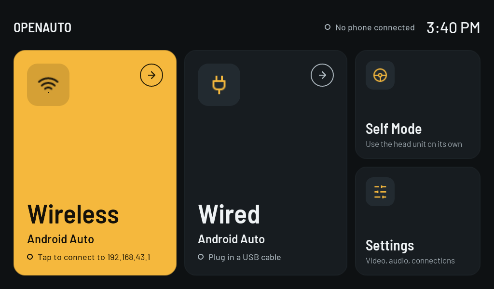
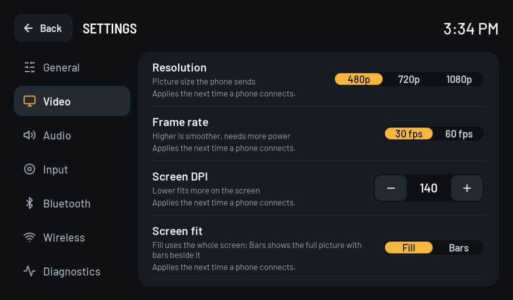
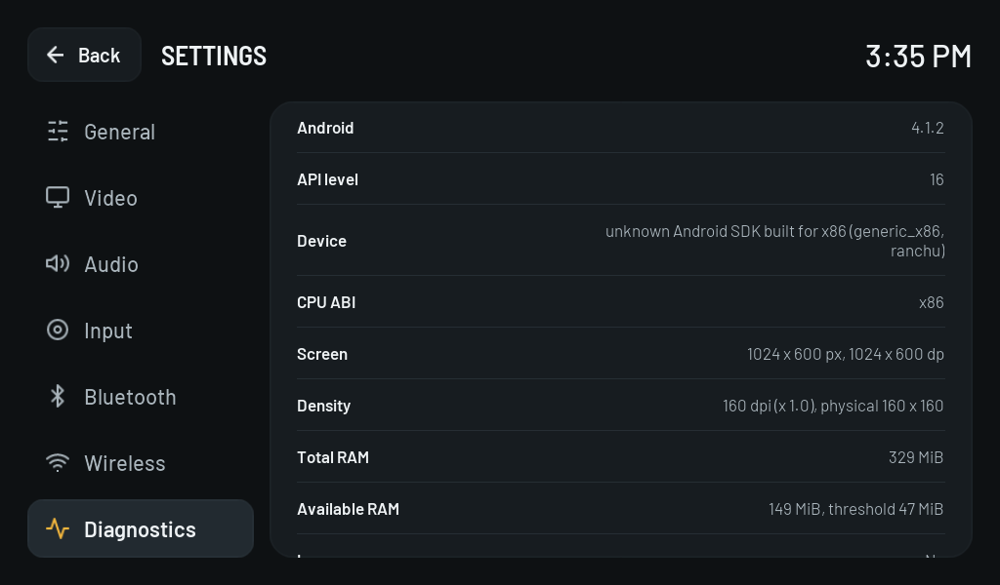
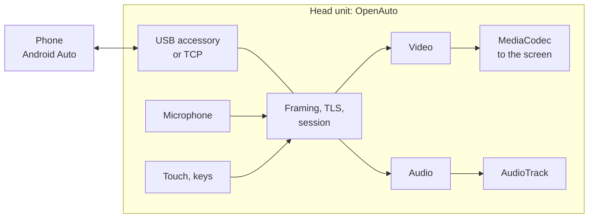

<p align="center">
  
</p>

<h1 align="center">OpenAuto</h1>

<p align="center">
  Android Auto on the Android car radio you already have, even an old and slow one.
</p>

<p align="center">
  
  
  
  
</p>

<p align="center">
  
</p>

OpenAuto is an Android Auto receiver. Install it on an Android head unit, connect a phone, and the
phone's Android Auto interface appears on the radio's screen with touch, music, navigation prompts
and the microphone.

It is written from scratch in Java against the plain platform APIs: no AndroidX, no Kotlin, no
frameworks. That keeps the APK at about 1 MB and lets it run on Android 4.1 with a few hundred
megabytes of RAM, the kind of radio that never got Android Auto from its manufacturer.

> Not affiliated with or endorsed by Google. Android Auto is a trademark of Google LLC. Google does
> not document the head-unit protocol; this implementation follows what open-source projects have
> worked out, see [docs/protocol-reference.md](docs/protocol-reference.md).

## Contents

[Features](#features) · [Quick start](#quick-start) · [Connecting a phone](#connecting-a-phone) ·
[Settings](#settings) · [How it works](#how-it-works) · [Status](#status) ·
[Troubleshooting](#troubleshooting) · [Building](#building) · [Development](#development)

## Features

| | |
|---|---|
| **Three ways to connect** | USB cable, Wi-Fi by IP address, or automatic wireless over Bluetooth and a hotspot (experimental) |
| **Self Mode** | Runs against Android Auto on the same device (Android 9+) |
| **Video** | H.264 through the hardware decoder straight to the screen, 480p to 1080p, 30 or 60 fps |
| **Any screen shape** | The phone lays out for the radio's aspect ratio, so wide 8:3 screens are filled without stretching |
| **Audio** | Music, navigation prompts and the assistant, with ducking; microphone for voice commands |
| **Touch** | Mapped to the phone's coordinates; media keys are passed on |
| **Fast on old hardware** | Encryption runs through the system's own OpenSSL on Android 4.1–5.1 |
| **Robust** | Reconnects after a dropped connection; clean stop from either side |
| **Diagnostics** | Device facts, decoders, USB devices, encryption speed and a connection log on one screen |

<p align="center">
  
  
</p>

## Quick start

1. Install the APK from [dist/](dist/) on the head unit:

   ```bash
   adb install -r dist/openauto-0.1.0-debug.apk
   ```

2. Plug the phone into the radio's USB port and tap **Wired**. Confirm the two USB dialogs; tick
   "use by default" on the second one.
3. Android Auto starts on the phone and shows up on the radio.

No USB port that Android can see? Use [Wi-Fi](#wireless-by-ip-address) instead.

## Connecting a phone

### Wired (USB)

1. The radio must expose USB host mode to Android: Settings › Diagnostics › "USB host" must say Yes.
2. Plug the phone in and tap **Wired**. Android asks for USB permission, the phone switches to
   accessory mode, and Android asks whether to open OpenAuto for that device. Tick "use by default"
   there and later connections need no dialog for that step.
3. A phone in "charging only" mode that shows no MTP, PTP, ADB or tethering interface is not
   recognised; switch it to file transfer once.

### Wireless by IP address

1. On the phone: Android Auto › tap the version number ten times › developer settings ›
   **Start head unit server**.
2. Put both devices on one network (for example the phone's hotspot).
3. On the radio: Settings › Wireless › Manual connection, enter the phone's IP address and port 5277.

### Automatic wireless (experimental)

Needs a Bluetooth adapter that apps can use, the phone paired and selected in Settings › Bluetooth,
and a hotspot the app can start. Settings › Wireless shows what is missing. The radio starts its
hotspot, hands the Wi-Fi credentials to the phone over Bluetooth and waits for it on TCP 5288.
Commercial dongles also present a Bluetooth headset profile, which an app cannot do with public
APIs; whether a phone connects without it is not verified.

### Self Mode

Android Auto and OpenAuto on the same device over loopback. Needs Android 9 or newer and the
**Start head unit server** developer setting. Unavailable on older radios, and the app says so.

### While projecting

Nothing of the app is drawn over the phone's interface. Back disconnects and returns to the
launcher; Android Auto's own Exit entry returns to the launcher and keeps the connection.

## Settings

| Category | What it holds |
|---|---|
| General | Keep screen on, start when a phone is plugged in, reset |
| Video | Resolution, frame rate, DPI, screen fit, video output, decoder, day and night colours |
| Audio | Media, navigation and assistant audio, microphone |
| Input | Media keys, Back key behaviour |
| Bluetooth | Adapter state, discoverable, phone for wireless |
| Wireless | Automatic connection, hotspot, manual connection, reconnect |
| Diagnostics | Everything needed to tell why something does not work |

Head units differ, so three Video settings are there to adapt:

| Setting | Default | Change it when |
|---|---|---|
| Screen fit: Fill / Bars | Fill | the phone's layout is cut off: Bars shows the whole frame |
| Video output: Auto / Direct / Direct 2 / Compatible | Auto | the picture is squeezed or shifted: try the next one. Direct and Direct 2 use the display hardware (fast) and differ in how the margins are cropped; Compatible draws the frame itself (always right, slower on weak GPUs) |
| Decoder: Hardware / Software | Hardware | the picture is corrupt or missing |

## How it works



The phone is the server and does the heavy lifting: it renders its interface, encodes it as H.264
and sends it together with PCM audio. The head unit authenticates with TLS, announces its screen,
audio and input capabilities, decodes what arrives and sends touch and microphone data back. Each
kind of data has its own channel inside one multiplexed, encrypted connection.

The protocol core in [`aa/`](app/src/main/java/me/ri3d/openauto/aa) is plain Java without Android
dependencies. More in the [design notes](docs/DESIGN.md) and the
[protocol reference](docs/protocol-reference.md).

## Status

| | |
|---|---|
| Wi-Fi by IP address | Works |
| Wired USB | Connects and projects on a real radio (ADAYO AC822X, Android 4.2.2, 1920x720) |
| Video, touch, media audio | Work; 30 fps on the emulators |
| Automatic wireless | Implemented, not yet verified with a phone |
| Microphone | Channel works; capture not yet exercised with the assistant |
| Phone calls, steering-wheel keys, start on boot | Not implemented |

The latest fixes (video artifacts, sound without picture on USB, USB permission wait) are verified
on emulators and still need a run on the radio. Details per feature: [docs/STATUS.md](docs/STATUS.md);
measurements and test logs: [docs/TEST-RESULTS.md](docs/TEST-RESULTS.md).

## Troubleshooting

| Problem | What to do |
|---|---|
| "The phone accepted the connection but did not answer" | Stop and start the head unit server in Android Auto's developer settings and keep the phone awake |
| Squeezed or shifted picture, or low frame rate | Settings › Video › Video output: try the next option |
| Corrupt or missing picture | Settings › Video › Decoder: Software |
| The phone is not found on USB | Settings › Diagnostics lists each USB device with a "phone / not a phone" verdict; switch the phone to file transfer |
| Wired says "USB host not supported" | The radio's USB port is not wired to Android; use Wi-Fi |

To report a problem, collect logs while reproducing it:

```bash
powershell -ExecutionPolicy Bypass -File tools\collect-radio-logs.ps1 <radio-ip>
```

The script gathers logcat, compositor state and CPU usage over ADB into `radio-logs/`.

## Building

Android Gradle Plugin 9.3.3, Gradle 9.5.0 (wrapper), JDK 21 (the Android Studio JBR works), compileSdk
36, minSdk 16, NDK 23.2.8568313 and CMake 3.22.1 from the SDK manager (they build a small JNI shim,
see [docs/DEPENDENCIES.md](docs/DEPENDENCIES.md)).

```bash
./gradlew :app:testDebugUnitTest :app:lintDebug :app:assembleDebug
```

Output: `app/build/outputs/apk/debug/app-debug.apk`. `assembleRelease` produces an unsigned APK until
a signing config is added.

## Development

The protocol core is tested on the JVM against a scripted phone, which can also serve an emulator:

```bash
# a scripted phone on port 5277 that streams an H.264 Annex B file
FAKE_PHONE_PORT=5277 FAKE_PHONE_VIDEO=stream.h264 ./gradlew :app:testDebugUnitTest --tests '*FakePhoneServerTest*' -i
# an emulator connects to it
adb shell am start -n me.ri3d.openauto/.LauncherActivity --es connect_ip 10.0.2.2 --ei connect_port 5277
```

`REAL_PHONE_HOST=<ip> ./gradlew :app:testDebugUnitTest --tests '*RealPhoneProbeTest*' -i` runs the
production session against a real phone from the build machine and traces every message.

| Path | Contents |
|---|---|
| `aa/` | framing, TLS, channels, session state machine, H.264 helpers |
| `transport/` | USB accessory and TCP transports |
| `media/` | video decoder, audio output, microphone |
| `wireless/` | Bluetooth credential exchange, hotspot |
| `ui/`, `settings/`, `diag/` | views, settings rows, diagnostics |
| `src/main/cpp/` | JNI shim over the system's OpenSSL |

Documentation: [design notes](docs/DESIGN.md) · [dependencies](docs/DEPENDENCIES.md) ·
[protocol reference](docs/protocol-reference.md) · [feature status](docs/STATUS.md) ·
[test results](docs/TEST-RESULTS.md)

## Known limitations

- No way of cropping the video margins works on every device, which is why Video output is a
  setting (docs/TEST-RESULTS.md §3a, §3b).
- Single-pointer touch; pinch gestures are not sent.
- The client certificate the phone requires is the one all open-source receivers embed; see
  docs/DESIGN.md §1. It is a replaceable asset under `app/src/main/assets/tls/`.
- Text is English only.

## Acknowledgements

The protocol knowledge comes from [aasdk](https://github.com/f1xpl/aasdk) and
[openauto](https://github.com/f1xpl/openauto) by f1xpl,
[WirelessAndroidAutoDongle](https://github.com/nisargjhaveri/WirelessAndroidAutoDongle),
[aa-proxy-rs](https://github.com/manio/aa-proxy-rs) and
[headunit](https://github.com/mikereidis/headunit). The implementation is independent of them; the
head-unit certificate is the one aasdk publishes.
Fonts: Barlow (SIL Open Font License). TLS: Bouncy Castle.
